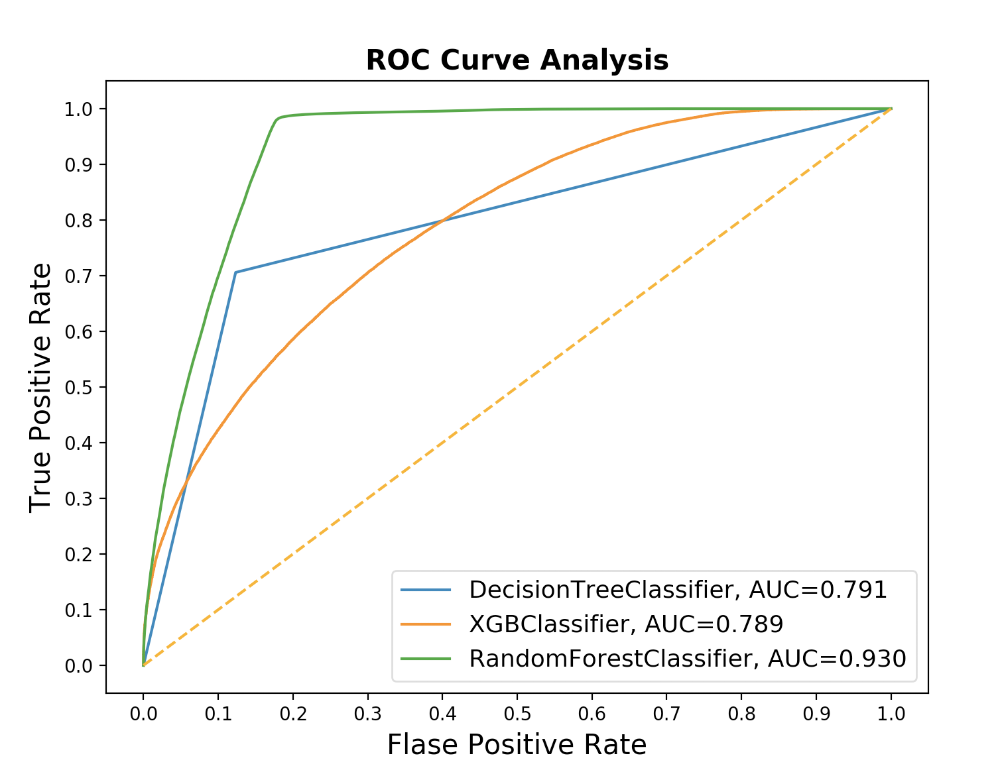

# Predict At-Bat Outcomes with MLB Data
This project uses Machine Learning methods and a Neural Network to predict at-bat outcomes, "out" or "on-base," using MLB data.
The analysis is driven based on the pitcher's perspective because we utilize info regarding the final pitch of the at bat:
type of pitch, pitch speed and location.

The data we used for this project can be found here: https://www.kaggle.com/pschale/mlb-pitch-data-20152018/data#

The files created and the respective steps of the process of the analysis are as follows:
1. `mlb.sql` gathers and groups the essential variables into a combined dataset.
2. `mlb_cleanse.py` cleans and encodes the combined dataset.
3. `mlb_final_v2.py` uses the cleaned data to run a Decision Tree, XGBoost, Random Forest, Voting Classifier and Neural Network.

Overall, the Random Forest performed the best. Below is a comparison of model performance using ROC Curves of the
Machine Learning Models:

Based on the graph above, the random forest outperforms the other models. However, to assure we are assisting pitchers to 
the best of our abilities, we adjust the threshold of classifying an "out" to be 82%. Changing the threshold from the generic
50% to 82% applies stricter guidelines to the Random Forest in classifying an outcome to be an "out." By doing so, we can now
provide more accurate information to a pitcher in hopes to help them get an "out."
